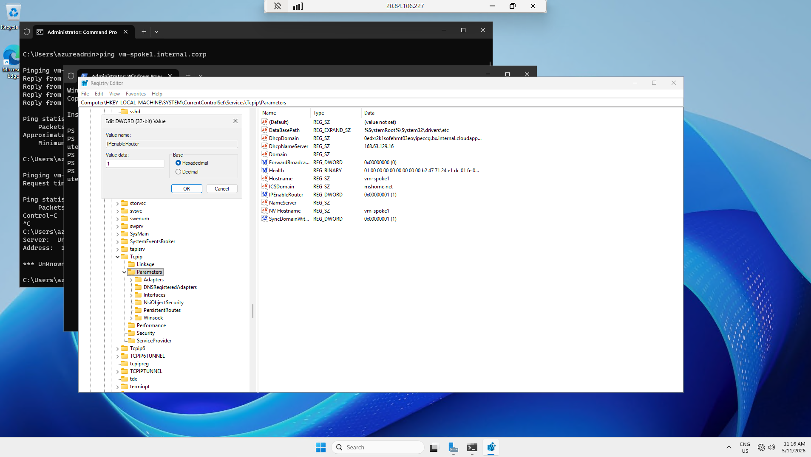

# azure-hub-and-spoke-architecture

# Azure Hub-and-Spoke Virtual Network Architecture

This repository documents the deployment, routing mechanics, and transit verification of a secure Hub-and-Spoke network topology within Microsoft Azure.

---

## 🏗️ 1. Architecture Overview
* **The Hub VNet:** Acts as the central point of connectivity for cross-premises networks and hosts shared infrastructure services (such as Azure Firewall, Virtual Network Gateways, or Private DNS Zones).
* **The Spoke VNets:** Isolated application tiers peered directly to the central Hub. Instead of peering spokes to each other in a messy mesh network, all inter-spoke traffic routes securely through the Hub.

### Network Configuration Matrix:
* **VNet Peering Sync:** Configured with **"Allow gateway transit"** on the Hub and **"Use remote gateways"** on the Spokes to support downstream hybrid environments.

---

## 🚏 2. Transitive Routing & Path Verification
By default, Azure VNet Peering is **non-transitive**. (If Spoke 1 is peered to Hub, and Spoke 2 is peered to Hub, Spoke 1 and Spoke 2 cannot talk to each other natively).

* **The Solution:** Implemented a central routing device/appliance in the Hub and deployed **User Defined Routes (UDRs)** on custom Route Tables attached to the Spoke subnets. 
* **The Next Hop Type:** Set to `Virtual Appliance` targeting the Hub's interface IP address for all cross-spoke traffic (`0.0.0.0/0` or specific CIDRs).

### Live Verification Data:
Successful ICMP echo and DNS queries validating that Spoke 1 can resolve and route data across the Hub to Spoke 2 instances securely:

---

## 📋 Key Administrative Takeaways
* Standardized network layer boundaries by preventing direct inter-spoke peering.
* Enforced structural asymmetry so security elements in the Hub can sweep or filter cross-spoke traffic profiles natively.
